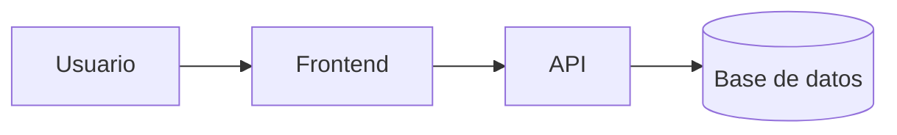

# Arquitectura: [Nombre de la funcionalidad]

- **Estado:** Borrador | En revisión | Aprobado
- **Versión:** 1
- **Aprobado por:**
- **Fecha de aprobación:**
- **Basado en:** `requerimientos.md` (versión/fecha)

## 1. Resumen de la solución
Descripción breve (3-5 líneas) de como se resuelve el problema.

## 2. Diagrama de componentes

## 3. Componentes
| Componente | Responsabilidad | Tecnología | Requisitos que cubre |
|------------|-----------------|------------|----------------------|

## 4. Modelo de datos
Entidades, campos principales y relaciones. Marca los datos personales o sensibles.

## 5. Interfaces / API
| Método | Ruta | Entrada | Salida | Errores |
|--------|------|---------|--------|---------|

## 6. Flujos principales
Secuencia de pasos de los casos de uso clave (puede incluir diagramas de secuencia).

## 7. Decisiones de arquitectura (ADR)
### ADR-01: [Título]
- **Contexto:** ...
- **Decisión:** ...
- **Alternativas consideradas:** ...
- **Consecuencias:** ...

## 8. Seguridad
Autenticación, autorización, manejo de secretos, protección de datos.

## 9. Dependencias nuevas
Cada paquete se comprobó en su registro oficial (ver constitución, sección 4.1).

| Paquete (nombre exacto) | Versión | Licencia | Registro oficial (enlace) | Último release | Motivo |
|-------------------------|---------|----------|---------------------------|----------------|--------|

## 10. Riesgos
| Riesgo | Impacto | Mitigación |
|--------|---------|------------|

## 11. Cumplimiento de la constitución
Confirma cada sección de `docs/constitucion.md` o justifica cualquier excepción.
