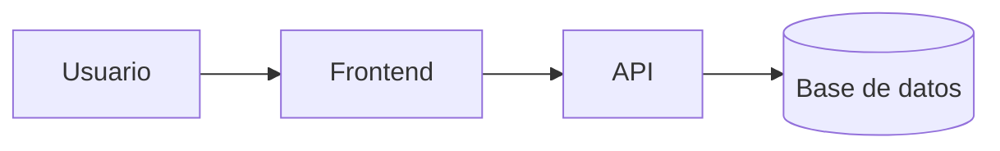

# Arquitectura: [Nombre de la funcionalidad]

- **Estado:** Borrador | En revision | Aprobado
- **Basado en:** `requerimientos.md` (version/fecha)

## 1. Resumen de la solucion
Descripcion breve (3-5 lineas) de como se resuelve el problema.

## 2. Diagrama de componentes

## 3. Componentes
| Componente | Responsabilidad | Tecnologia | Requisitos que cubre |
|------------|-----------------|------------|----------------------|

## 4. Modelo de datos
Entidades, campos principales y relaciones. Marca los datos personales o sensibles.

## 5. Interfaces / API
| Metodo | Ruta | Entrada | Salida | Errores |
|--------|------|---------|--------|---------|

## 6. Flujos principales
Secuencia de pasos de los casos de uso clave (puede incluir diagramas de secuencia).

## 7. Decisiones de arquitectura (ADR)
### ADR-01: [Titulo]
- **Contexto:** ...
- **Decision:** ...
- **Alternativas consideradas:** ...
- **Consecuencias:** ...

## 8. Seguridad
Autenticacion, autorizacion, manejo de secretos, proteccion de datos.

## 9. Dependencias nuevas
| Paquete | Version | Motivo |
|---------|---------|--------|

## 10. Riesgos
| Riesgo | Impacto | Mitigacion |
|--------|---------|------------|

## 11. Cumplimiento de la constitucion
Confirma cada seccion de `docs/constitucion.md` o justifica cualquier excepcion.
