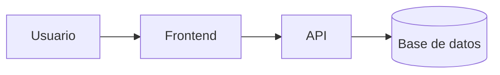

# Mapa del sistema: [Nombre del proyecto]

- **Estado:** Borrador | En revisión | Aprobado
- **Aprobado por:**
- **Fecha de aprobación:**
- **Generado a partir del commit:**

> Describe el sistema **tal como está hoy**, no como debería estar. Todo lo que no se pudo
> confirmar leyendo el código se marca como **(sin confirmar)**.

## 1. Resumen
Qué hace el sistema, para quién, en 3-5 líneas.

## 2. Stack detectado
| Capa | Tecnología | Versión | Dónde se ve |
|------|------------|---------|-------------|

## 3. Estructura
Carpetas principales y su responsabilidad.

## 4. Componentes y flujo

## 5. Modelo de datos
Entidades principales y relaciones. Marca los datos personales o sensibles.

## 6. Integraciones externas
| Sistema | Para qué | Cómo (API, archivo, cola...) | Credenciales en |
|---------|----------|------------------------------|-----------------|

## 7. Funcionalidades existentes
Candidatas a tener su propia carpeta en `specs/` cuando se modifiquen.

| Funcionalidad (kebab-case) | Descripción | Archivos principales | ¿Tiene pruebas? |
|----------------------------|-------------|----------------------|-----------------|

## 8. Cómo se ejecuta y se comprueba
| Acción | Comando detectado | Funciona |
|--------|-------------------|----------|
| Instalar | | (sin confirmar) |
| Pruebas | | (sin confirmar) |
| Lint | | (sin confirmar) |
| Build / tipos | | (sin confirmar) |

## 9. Convenciones detectadas
Estilo, nombres, idioma del código, estructura de capas, manejo de errores, commits.

## 10. Propuestas de configuración
Valores sugeridos para que el usuario los revise y los copie (el arquitecto no edita estos archivos):
- `docs/constitucion.md`: ...
- `.sdd/config.json`: ...

## 11. Riesgos y deuda técnica
| Riesgo | Dónde | Impacto | Sugerencia |
|--------|-------|---------|------------|
